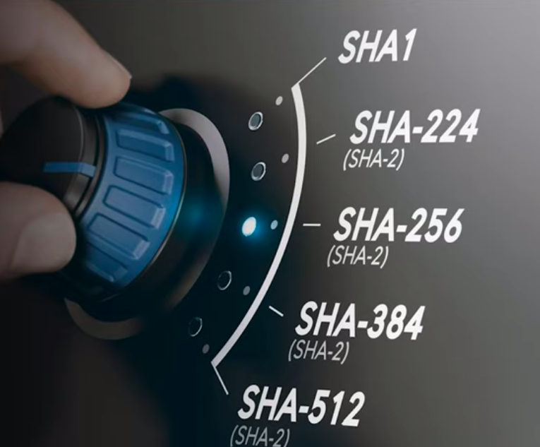
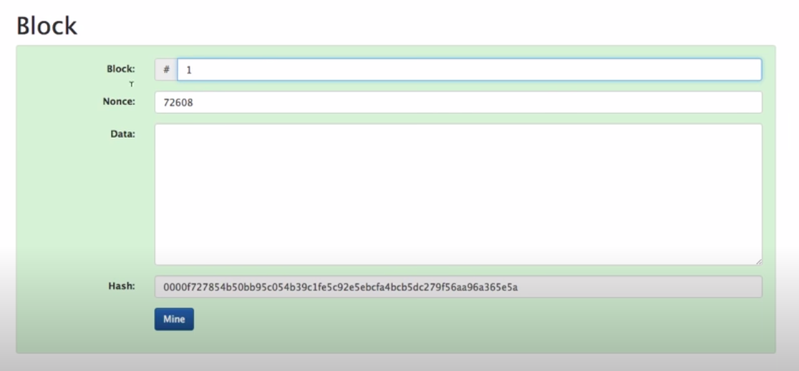
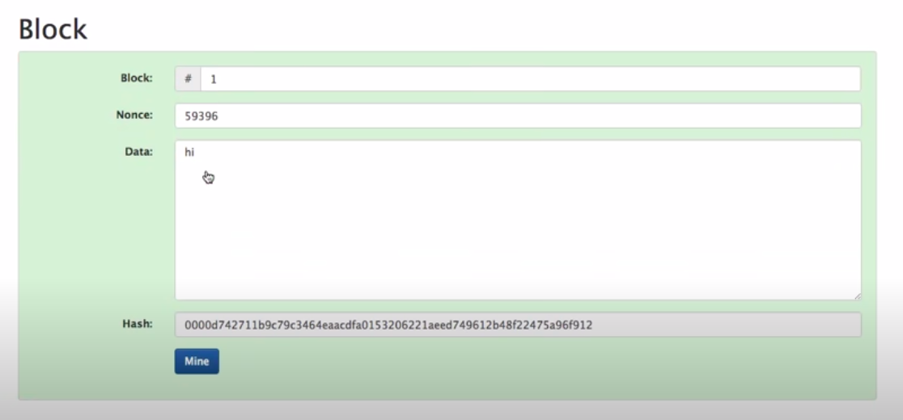
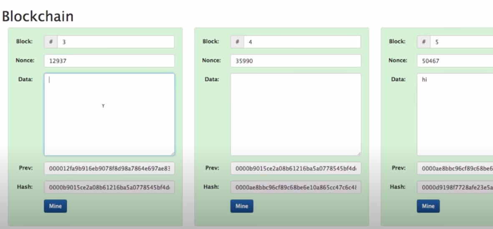
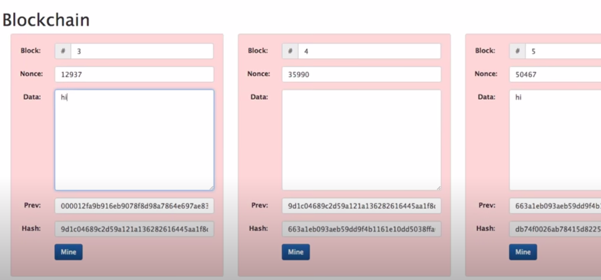
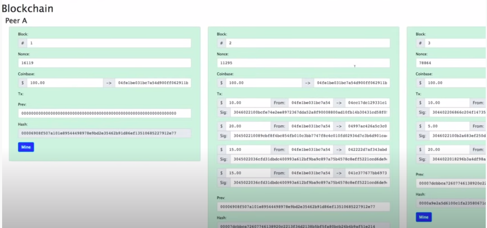
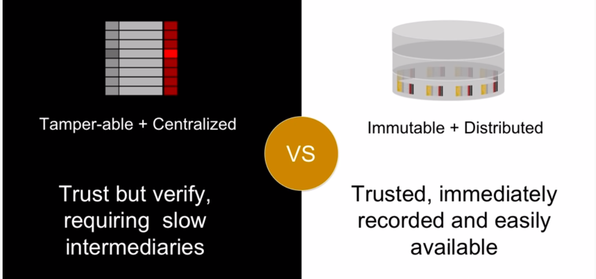

# SHA 256

## Fact: SHA 256 of Empty String

```
e3b0c44298fc1c149afbf4c8996fb92427ae41e4649b934ca495991b7852b855
```

SHA 256 of empty string will be always the above string.


## SHA 256 of Praveen

```
a95a2ca6166bcb55a969401a63e960ada7295a27183500b321ac3f7c4cc6e681
```

https://emn178.github.io/online-tools/sha256.html



# SHA-2

SHA-2 (Secure Hash Algorithm 2) is a set of cryptographic hash functions designed by the United States National Security Agency (NSA) and first published in 2001.[3][4] They are built using the Merkle–Damgård construction, from a one-way compression function itself built using the Davies–Meyer structure from a specialized block cipher.

https://en.wikipedia.org/wiki/SHA-2

# Blocks

## Original Block



Now let's enter 'Data'. Data = 'hi'. Immediately the Hash will be changed. And try to find a Nonce such that Hash starts with '0000' again. Put 1 in the Nonce. Then 2, 3, 4, etc.

NO! don't do it manually. Click the 'Mine' button.

## Mined!



# Blockchain

We can chain the above described blocks to create a blockchain.



And if change the data in a block all blocks after that block will be invalid (Will not start the hash with '0000')



You will have to remine all the successive blocks after change.

## 51% Attacks

https://dci.mit.edu/51-attacks


### PoW 51% Attack Cost
https://www.crypto51.app/

# Distributed Blockchain

What happens when many peers have a (distributed) copy of the blockchain. Can you change the block data?

Yes, you can. But your copy will be rejected (as modified) by the peers. They will check the hash of the last block and know that you have done modification to the blockchain (data). You will lose the trust. You will be discarded.

# Financial Transactions on Distributed Blockchain (with PKI)

Your private key is your identity. You sign the transaction (amount, your public key, recepient public key) with your private key. Send the details to the distributed blockchain. Peers verify that the transaction is done by you (PKI) with your private key. Now it is on the distributed blockchain. Everyone knows it. You cannot say no later. Nor you can change what is recorded in the distributed blockchain (See 51% attack).

See below, it all starts with a coinbase. See how transactions are recorded and mined on the distributed blockchain.



# Trust

Trust: Fundemental currency of commerce.

In a distributed blockchain peers trust each other based on the hash of the last block.

Blockchain: Massively Simplified | Richie Etwaru | TEDxMorristown https://www.youtube.com/watch?v=xIDL_akeras

Problem: Old ledgers are tamper-able.

Solution: Distributed Immutable Ledger (Blockchain)



# Ether

ETH: 0xc9EC3F012353bff6C0F7dAcc5f8D7F50611De846

See it live: https://etherscan.io/address/0xc9ec3f012353bff6c0f7dacc5f8d7f50611de846


# Blockchain and Metaverse

Is a Virtual Reality Metaverse based on blockchain and a decentralized economy our future? Will virtual marketplaces filled with NFTs act as an equitable replacement for our existing infrastructure, giving access to billions of people that would otherwise lack access to financial resources and ways to earn a living?  

The future of an immersive Metaverse | Artur Sychov | TEDxUNYP: https://www.youtube.com/watch?v=odbqlASYv9E
